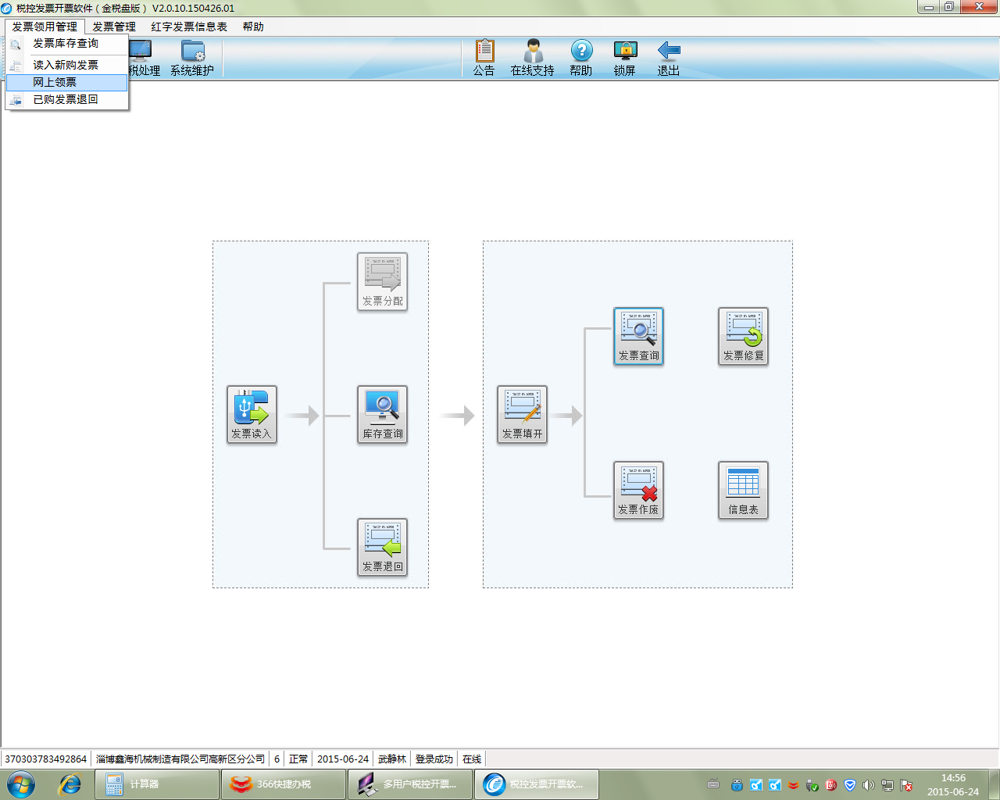
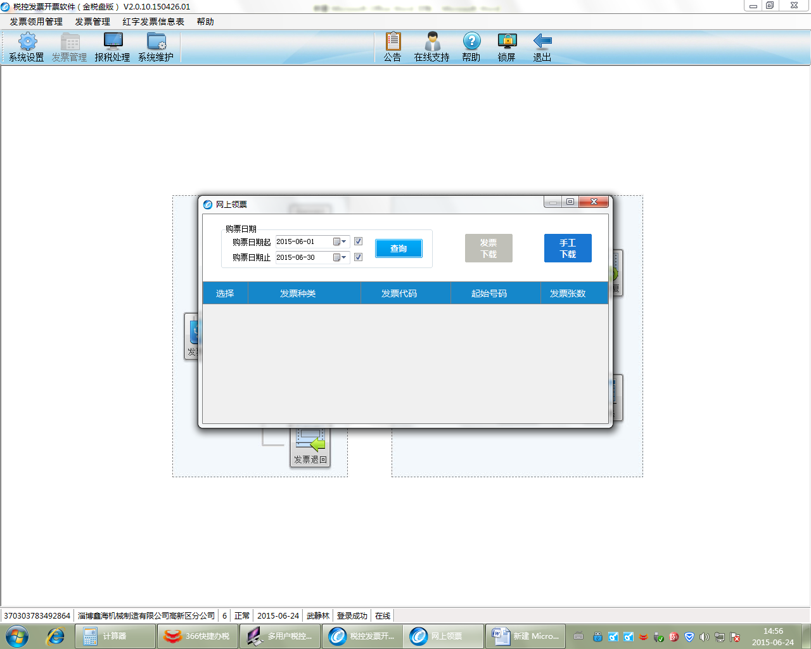
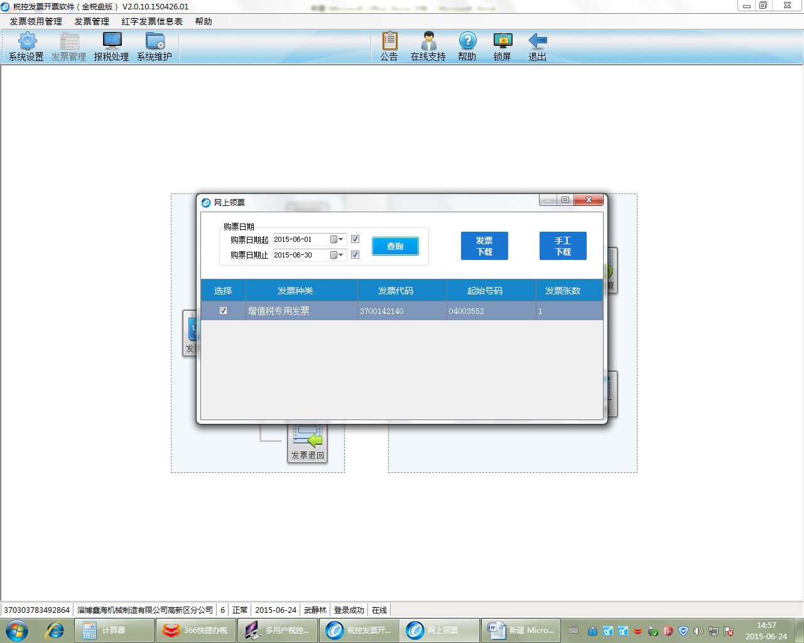
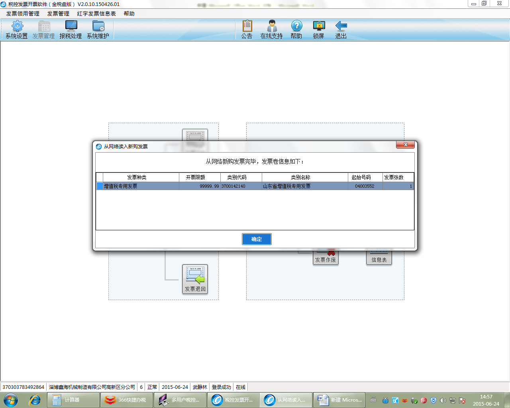
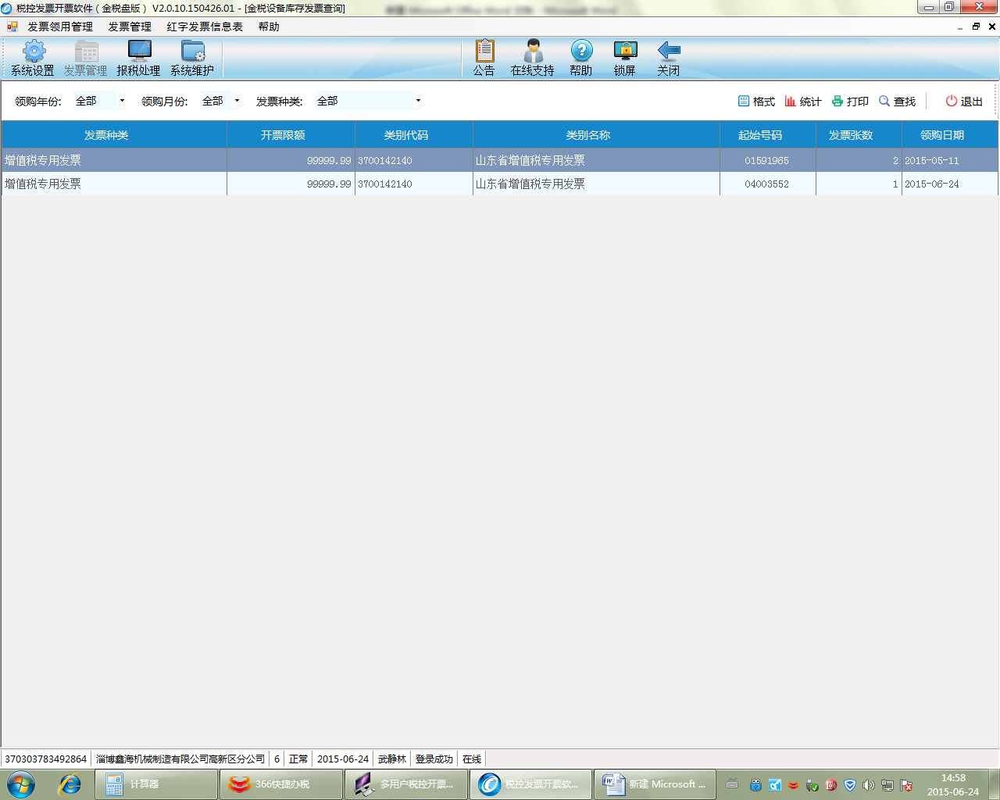

##网上领票so easy（金税盘版）

1、进入开票系统（版本必须为V2.0.10.150426及以上），点击“发票管理/发票领用管理/网上领票，如下图：

2、在弹出的网上领票模块中，点击查询。

3、系统会自动显示从税局购买的发票种类、代码、起始号码、发票张数。

4、点击“发票下载”，系统进入“从网络读入新购发票”模块，并提示“从网络新购发票完毕”并显示发票卷信息，如下图

5、点击“确定”，发票即读入到开票系统中，网上领票功能操作完毕，直接开具发票即可。
